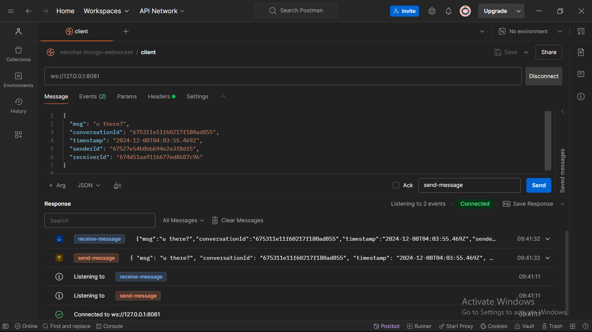
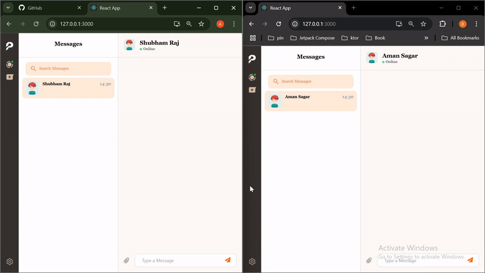

# PeerTalk

## About
- A real time one-to-one chat application that has a frontend build with React using typescript and backend build with express which used mongodb as the database.
- It has online indicator feature to show whether user is online or not

## Table of Contents
- [Bult using](#bult-using)
- [Server setup prerequisite](#server-setup-prerequisite)
- [Db structure](#db-structure)
- [Api documentation](#api-documentation)
- [How to run project](#how-to-run-project)
- [Room for improvement](#room-for-improvement)
- [Upcoming Features and Enhancements](#upcoming-features-and-enhancements)
- [Current Demo](#current-demo)

### Built using

* **Backend**
    - Typescript
    - Express
    - Mongodb
    - Mongoose Library
    - JWT
    - Socket.io
    - Bcrypt
    - Turborepo


* **Frontend Web**
    - Typescript
    - React
    - Tailwind
    - Socket.io
    - Axios
    - Redux
    - React Hook Form

### Server setup prerequisite
- Docker must be installed to run MongoDB as a container. Once Docker is installed, execute the following command to start the MongoDB container:
```
docker run -d -p 27018:27017 --name mongodb mongo
```


### Db structure


### Api documentation
- Import this collection in postman - [Collection](./Files/peertalk.json)
- For description of the api click on this icon in postman
  
- Api for sending message
  

### How to run project
- Node js must be installed
- Clone the project with
```
https://github.com/AmanSagar0433/MessagingApp.git
```
- Navigate to the directory
```
cd MessagingApp
```
- Install the dependencies with
```
npm i
```
- run with
```
npm run dev
```


### Room for improvement

* **Scaling backend**


### Upcoming Features and Enhancements
- Support for group chat
- Support for black theme
- User will be able to edit and delete the message
- Video calling feature using WebRTC

### Current Demo

